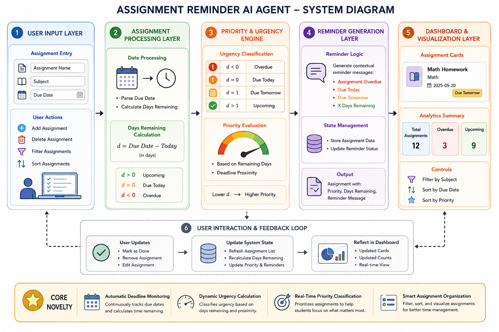
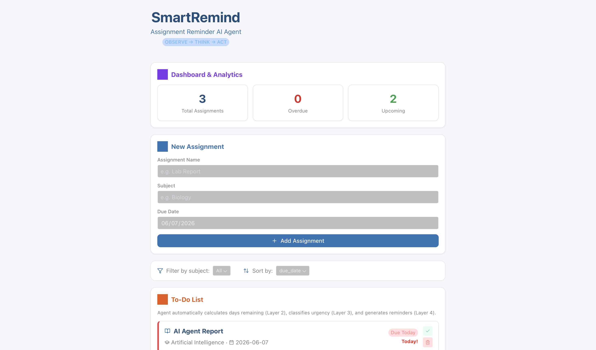

# SmartRemind: Assignment Reminder AI Agent

## Overview

SmartRemind is a Reflex-based Assignment Reminder AI Agent designed to help students manage academic deadlines more effectively. The system tracks assignments, calculates urgency levels based on due dates, generates contextual reminders, and provides a dashboard for monitoring upcoming and overdue tasks.

The goal of SmartRemind is to reduce missed deadlines and improve student time management through automated deadline awareness and assignment prioritization.

---
## System Diagram



---

## Features

### Assignment Management

* Add new assignments
* Delete assignments
* Mark assignments as completed
* Restore completed assignments

### Deadline Monitoring

* Automatic due date tracking
* Remaining days calculation
* Overdue assignment detection

### Priority Classification

Assignments are automatically categorized into:

* Overdue
* Due Today
* Due Tomorrow
* Upcoming

### Reminder Generation

The system generates contextual reminders based on assignment urgency.

Examples:

* Assignment overdue
* Due today
* Due tomorrow
* X days remaining

### Dashboard Analytics

* Total assignments
* Overdue assignments
* Upcoming assignments
* Priority indicators

### Organization Tools

* Filter assignments by subject
* Sort assignments by due date
* Sort assignments by priority

---

## System Architecture

The application follows a layered architecture:

1. User Input Layer
2. Assignment Processing Layer
3. Priority & Urgency Engine
4. Reminder Generation Layer
5. Dashboard & Visualization Layer
6. User Feedback Loop

Core functionality includes:

* Automatic deadline monitoring
* Dynamic urgency calculation
* Context-aware reminder generation
* Assignment prioritization

---

## Technology Stack

### Frontend

* Reflex 0.9.4

### Backend

* Python 3.13

### Data Model

* Pydantic

### Development Tools

* Bun
* Git
* GitHub

---

## Installation

### Clone the Repository

```bash
git clone https://github.com/YOUR_USERNAME/smartremind_reflex.git
cd smartremind_reflex
```

### Install Dependencies

```bash
pip install -r requirements.txt
```

### Run the Application

```bash
reflex run
```

The application will be available at:

```text
http://localhost:3000
```

---

## Project Structure

```text
smartremind_reflex/
│
├── smartremind_reflex/
│   ├── __init__.py
│   └── smartremind_reflex.py
│
├── assets/
├── requirements.txt
├── reflex.lock
├── package.json
├── bun.lock
├── rxconfig.py
├── README.md
```

---

## Screenshots

### Dashboard





---

## Future Improvements

* Email reminder integration
* Calendar synchronization
* Recurring assignment support
* User authentication
* Persistent database storage
* Mobile-responsive enhancements

---

## Author

Siti Aisyah binti Rajim


